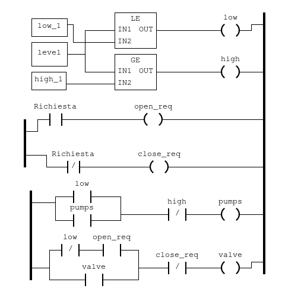

# Components of PLC1 (user program, protocols, ports)
## Content
1. Dockerfile
1. openplc.py
1. PLC1.st
1. run.sh

### Dockerfile
1. Clones the github repo from https://github.com/thiagoralves/OpenPLC_v3.git
1. Installs it
1. Creates the directory for .st files (ladder logic)
1. Copies the run.sh script into the container
1. Exposes port:
    - 502 for Modbus protocol
    - 6668\udp for simlink communication
    - 8080 for OpenPLC Web interface

### run.sh
1. SQL insert query to the database the name and the link of the .st file ???????????
1. Sets the PLC to start executing the .st script on boot ???????????
1. Copies the st script to the internal openplc folder ???????????
1. Sets the st as the active program (i.e. the script to be executed) ???????????
1. Sets the hardware form blank to Simulink with DNP3 to allow Simulink to connect to OPENPLC throught the simlink script ???????????
1. Start OPENPLC

### PLC1.st
The ladder logic script for the first water tank in the SWAT system ????
#### Logic

The PLC1 receives as input the level of the tank 1 (T1) from the simulink sketch (port 6668\udp) and the open and close boolean request for the valve that connects the tank 1 (T1) to the tank 2 (T2), from the PLC2 on modbus protocol (port 502\tcp). 
As outputs the PLC1 tells the pumps and the valve to open.
There are two constants low_l and high_l that sets the limits of the tank and two relay called open_req and close_req that control the valve (controlled by the contact Richiesta).
1. If the level is below or equal low_l the relay low is set to true and if the contact pump is true and if the contact high is not true then the relay pump is set to open 
1. If the level is over or equal high_l then the relay high is set to true and the relay pump remains to false
1. If the contact low is false and the contact open_req is true and if the contact close_req is not true then the relay valve is opened (valve is set to true)
1. If the contact valve is true and the contact close_req is not true then the relay valve stays on (valve set to true)
