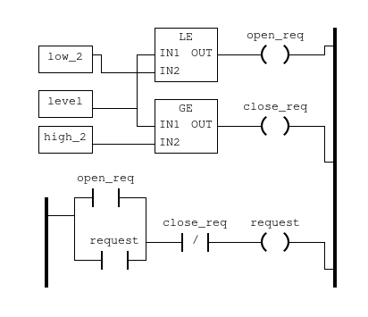

# Dockerfile for PLC2 in Water treatment plant
## Content
1. Dockerfile
1. openplc.py
1. PLC2.st
1. run.sh

### Dockerfile
1. Clones the github repo from https://github.com/thiagoralves/OpenPLC_v3.git
1. Installs it
1. Creates the directory for .st files (ladder logic)
1. Copies the run.sh script into the container
1. Exposes port:
    - 502 for Modbus protocol
    - 6668\udp for simlink communication
    - 8080 for Openplc Web interface

### run.sh
1. SQL inserts into the database the name and the link of the .st file
1. Sets the PLC to start executing the .st script on boot
1. Copies the st script to the internal openplc folder
1. Sets the st as the active program (i.e. the script to be executed)
1. Sets the hardware form blank to Simulink with DNP3 to allow Simulink to connect to OPENPLC throught the simlink script
1. Start OPENPLC

### PLC2.st
The ladder logic script for the second water tank in the SWAT system
#### Logic

The PLC2 receives as input the level of the tank 2 (T2) from the simulink sketch (port 6668).
As outputs the PLC2 tells the PLC1 to open/close the valve, through modbus protocol (port 502).
There are two constants low_2 and high_2 that sets the limits of the tank.
1. If the level is below or equal low_2 then the relay open_req is set to true 
1. If the level is over or equal high_2 then the relay close_req is set to true 
1. If the contact open_req is true or the contact request is true and the contact close_req is not true then the relay request is set to true
